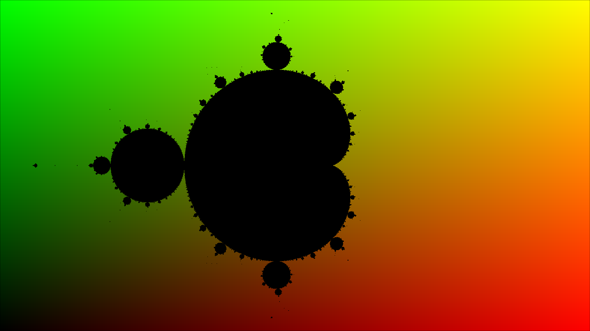

# Mandelbrot Set Visualizer with GLSL Shaders



## 📖 Overview

This project is an interactive real-time Mandelbrot Set visualizer built with **Processing** and **GLSL shaders**. It leverages GPU acceleration to render the famous Mandelbrot fractal in real-time, allowing users to explore the infinite complexity and beauty of this mathematical set through smooth navigation and zooming capabilities.

The Mandelbrot Set is a set of complex numbers defined by the iterative formula:
```
z(n+1) = z(n)² + c
```
where points that remain bounded (don't diverge to infinity) belong to the set.

## ✨ Features

- **Real-time GPU-accelerated rendering** using GLSL fragment shaders
- **Interactive navigation** with smooth keyboard controls
- **Infinite zoom capability** to explore fractal details at any scale
- **High-performance rendering** at up to 144 FPS
- **Colorful visualization** showing the boundary regions of the set
- **1280x720 resolution** with P3D renderer for optimal performance

## 🎮 Controls

| Key | Action |
|-----|--------|
| **W** | Move up |
| **S** | Move down |
| **A** | Move left |
| **D** | Move right |
| **Q** | Zoom out |
| **E** | Zoom in |

The controls are smooth and responsive - hold down keys for continuous movement or zooming.

## 🛠️ Requirements

- **Processing 4.x** (or Processing 3.x)
- **OpenGL-compatible graphics card** with GLSL 3.3+ support (GLSL 4.6 recommended)
- **Operating System**: Windows, macOS, or Linux

## 📥 Installation

1. **Install Processing**
   - Download from [processing.org](https://processing.org/download)
   - Install and launch the Processing IDE

2. **Clone or Download this Repository**
   ```bash
   git clone https://github.com/omselkara/Mandelbrot-Shader.git
   cd Mandelbrot-Shader
   ```

3. **Open the Project**
   - Launch Processing IDE
   - Go to `File > Open` and select `mandelbrot.pde`
   - Ensure `shader.glsl` is in the same directory

4. **Run the Sketch**
   - Click the "Run" button (▶️) in Processing IDE
   - Or press `Ctrl+R` (Windows/Linux) / `Cmd+R` (macOS)

## 🚀 Usage

1. **Launch the application** - The Mandelbrot Set will be rendered in a 1280x720 window
2. **Navigate the fractal** using WASD keys to move around
3. **Zoom in/out** using Q and E keys to explore details
4. **Frame rate display** is shown in the top-left corner for performance monitoring

The visualization starts centered at the origin (0, 0) in the complex plane, showing the classic Mandelbrot Set shape.

## 🔧 Technical Details

### Architecture

The project consists of two main components:

#### 1. **Processing Sketch** (`mandelbrot.pde`)
- Handles user input and application state
- Manages the shader pipeline
- Updates camera position and zoom level
- Renders the fractal using the shader
- Displays performance metrics (FPS)

#### 2. **GLSL Fragment Shader** (`shader.glsl`)
- Implements the Mandelbrot Set algorithm on the GPU
- Uses complex number arithmetic (custom struct)
- Iterates each pixel to determine set membership
- Applies color mapping for visualization

### Key Parameters

```processing
// Adjustable in mandelbrot.pde:
frameRate(144);              // Target frame rate
size(1280,720,P3D);         // Window dimensions
shader.set("n",1000);       // Maximum iterations
shader.set("threshold",1000000000.0f); // Divergence threshold
```

### Shader Implementation

The shader implements:
- **Complex number multiplication and addition**
- **Mandelbrot iteration formula**: z = z² + c
- **Divergence test**: checks if |z| exceeds threshold
- **Color mapping**: Points in the set are black, boundary regions are colorful

### Performance

- **GPU acceleration** ensures smooth rendering even at high resolutions
- **Adaptive iteration count** (1000 iterations) balances detail and performance
- **144 FPS target** for ultra-smooth navigation
- **P3D renderer** optimizes OpenGL communication

## 🎨 Color Scheme

- **Black**: Points within the Mandelbrot Set (bounded behavior)
- **Gradient colors**: Points outside the set (boundary region) with colors based on screen position

## 📝 Code Structure

```
Mandelbrot-Shader/
├── mandelbrot.pde      # Main Processing sketch
├── shader.glsl         # GLSL fragment shader
├── sketch.properties   # Project configuration
├── image.png          # Preview image
└── README.md          # This file
```

## 🔬 Mathematical Background

The Mandelbrot Set is defined in the complex plane. For each complex number `c = x + yi`:
1. Start with `z₀ = 0`
2. Iterate: `z(n+1) = z(n)² + c`
3. If the sequence remains bounded (|z| < threshold), `c` is in the set
4. The set exhibits self-similarity at all scales (fractal property)

## 🎯 Future Enhancements

Potential improvements:
- [ ] Mouse-based navigation and zooming
- [ ] Color palette customization
- [ ] Julia Set mode
- [ ] Save/export high-resolution images
- [ ] Smooth coloring algorithm for better gradients
- [ ] Variable iteration count based on zoom level
- [ ] Position/zoom state saving and loading

## 🐛 Troubleshooting

**Problem**: Shader doesn't compile
- **Solution**: Ensure your GPU supports GLSL 4.6. Try changing `#version 460 core` to `#version 330 core` in `shader.glsl`

**Problem**: Low frame rate
- **Solution**: Reduce the iteration count (`n` parameter) or window resolution

**Problem**: Window doesn't open
- **Solution**: Verify Processing is correctly installed and P3D renderer is available

## 📄 License

This project is open-source. Feel free to use, modify, and distribute as needed.

## 🤝 Contributing

Contributions are welcome! Feel free to:
- Report bugs and issues
- Suggest new features
- Submit pull requests
- Improve documentation

## 👤 Author

Created by [omselkara](https://github.com/omselkara)

## 🌟 Acknowledgments

- Benoît Mandelbrot for discovering this fascinating mathematical set
- Processing Foundation for the excellent creative coding framework
- The OpenGL and GLSL communities for shader programming resources

---

**Enjoy exploring the infinite beauty of the Mandelbrot Set! 🌀**
